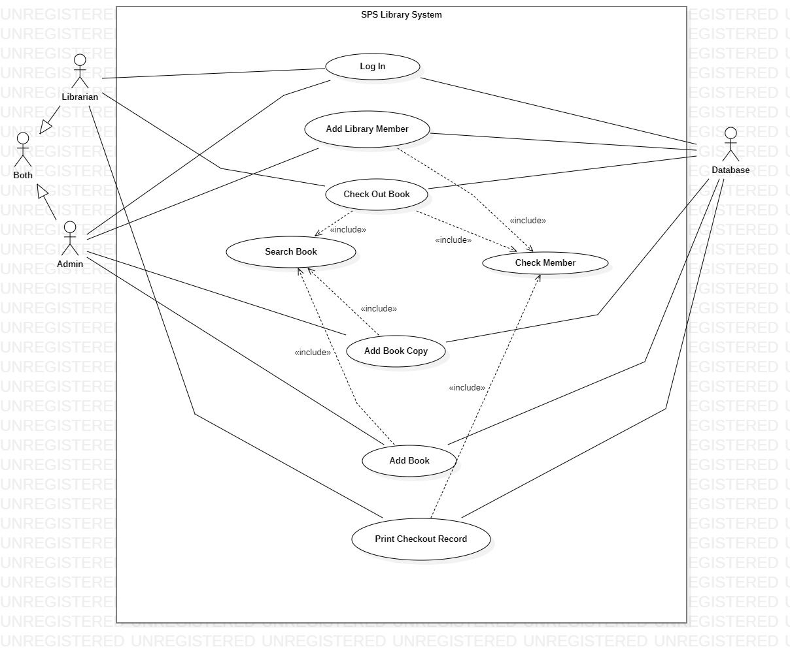
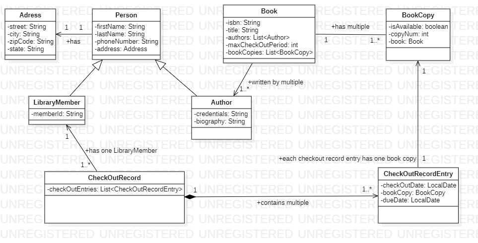
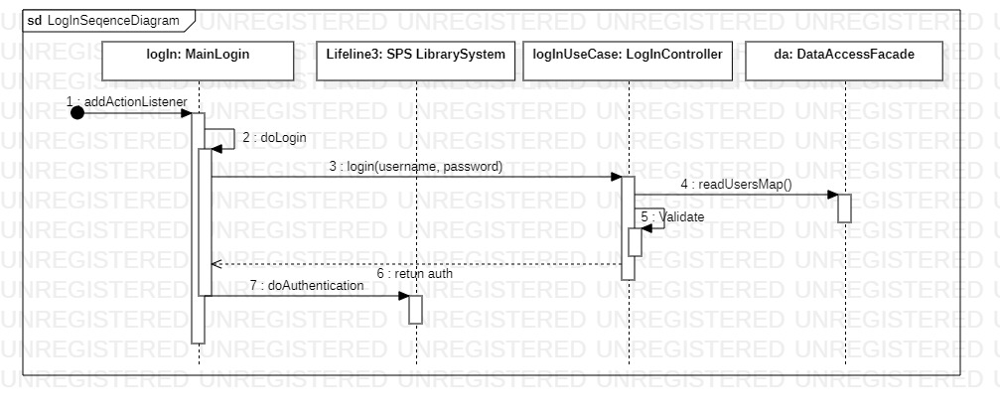
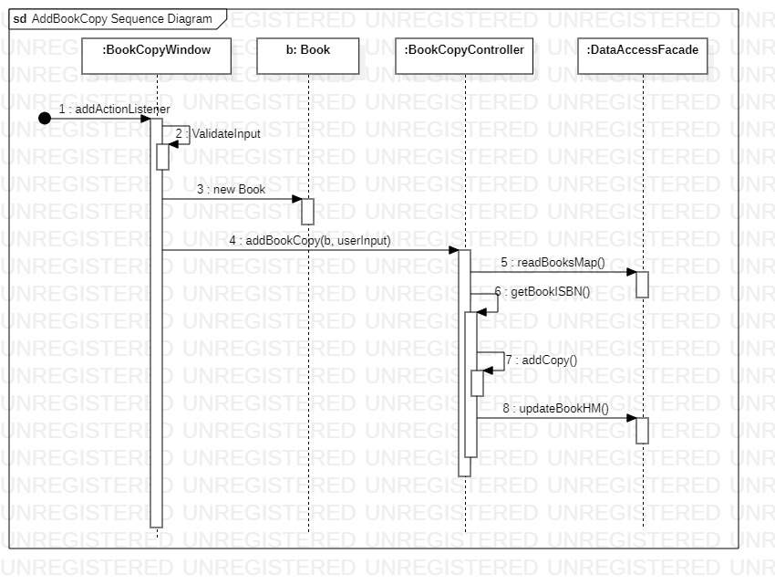

## Overview
This is the library system implementation for MPP Project

### Total Number of Use Cases - 6
1. Login Use Case
2. Add Library Member Use Case
3. Checkout Book Use Case
4. Add Book Copy Use Case
5. Add Book Use Case
6. Print Check Out Record Use Case 

### List of implemented Use Cases

##### 1. Login Use Case
 According to the problem requirements, when we run the app it opens the login page and from there user 
 can enter his ID and password. Then he/she presses submit which causes the system to search the credentials 
 from the data store. If this user exists it opens the next page, otherwise it shows error.
 
 User can be Librarian, Admin or Both. 
 For admin, you should submit with ID: Phyo, and password: phyo.
 For librarian, you should submit with ID: Sandhya, and password sandhya.
 For superuser, please use Username: Soe and password: soe.
 
 If there is no default data, you can run the TestData.java under librarysystem.dataaccess package. This will create default data for this application.
 

##### 2. Add Library Member Use Case
Admin can add new member and new book to the system, but can not check out book. If the user is both admin and
librarian he/she can also check out. 

##### 3. Checkout Book Use Case
Librarian can check out books if he enters the member ID and ISBN number correctly, otherwise system presents error.
If the requested book and member ID are found then librarian can create new record entry to this member.

##### 4. Add Book Copy Use Case
Admin can add new copies to the existing book by looking for the ISBN of that book.

##### 5. Add Book Use Case
Admin can add new book to the library collection by pressing addBook section in Books page. Then he will be asked for the necessary fields for adding new book.

##### 6. Print Check Out Record Use Case 
When user logins as a Librarian he can print the checkout record for a particular user by entering his/her member ID in a checkout record page, the system searches for ID and shows the record. If librarian prints this record it prints in a console.# mpp-library-project

### Technology Use
1. Java Swing
2. Object Oriented Analysis and Design
3. Object File Database

## Design
##### Use Case Diagram

##### Domain Class Diagram
Below image is the domain object model for library system.
 

##### Overall Class Diagram
Below image is the overall class diagram for library system. This is more on flow connecting with the UI, Controller and Data Access.
 

##### 1. Sequence Diagram - Log In Use Case

##### 2. Sequence Diagram - Add Library Member Use Case

##### 3. Sequence Diagram - Checkout Book Use Case

##### 4. Sequence Diagram - Book Copy Use Case

##### 5. Sequence Diagram - Add Book Use Case

##### 6. Sequence Diagram - Print Checkout Records Use Case

### GitHub Url
https://github.com/soethandar90/mpp-pj-sps
